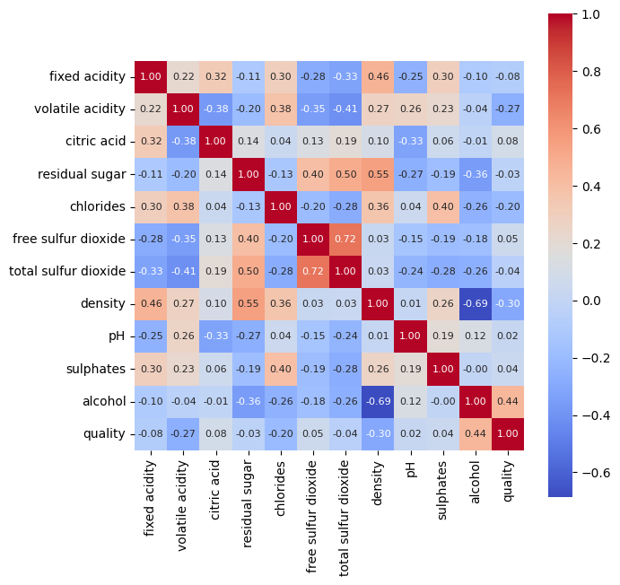

# Wine-Quality-prediction
Wine quality Machine learning model
# Wine Quality Prediction with Random Forest classifier
This project aims to predict the quality of wines using a Random Forest classifier. The Random Forest algorithm is a powerful machine learning technique that is widely used for classification and regression tasks. In this project, we train a Random Forest model on a dataset of wine samples with known quality ratings and use it to predict the quality of new, unseen wine samples.
# Dataset
The dataset used in this project contains various physicochemical properties of wine samples along with their quality ratings. The dataset is split into two parts: a training set and a test set. The training set is used to train the Random Forest model, while the test set is used to evaluate its performance.The dataset contains the following features:
- Fixed Acidity
- Volatile Acidity
- Citric Acid
- Residual Sugar
- Chlorides
- Free Sulfur Dioxide
- Total Sulfur Dioxide
- Density
- pH
- Sulphates
- Alcohol
The target variable is the "Quality" rating, which represents the quality of the wine on a scale from 3 to 9 and would also classify wine quality as good or not
#Visualisation

